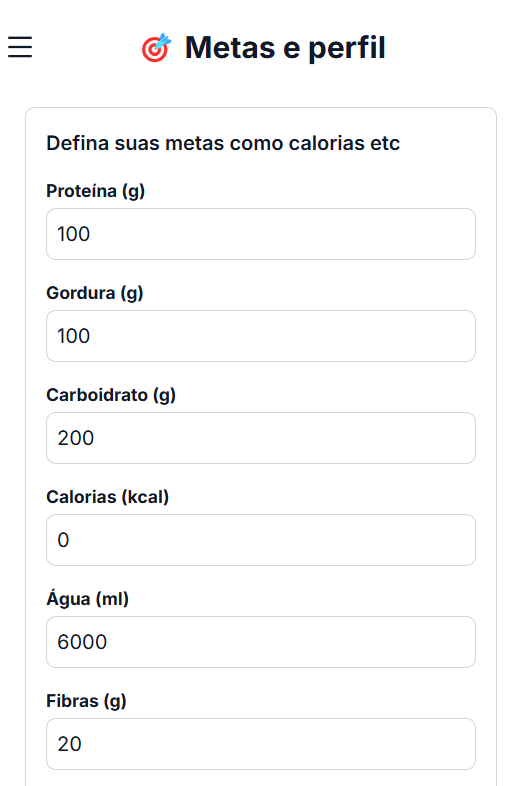
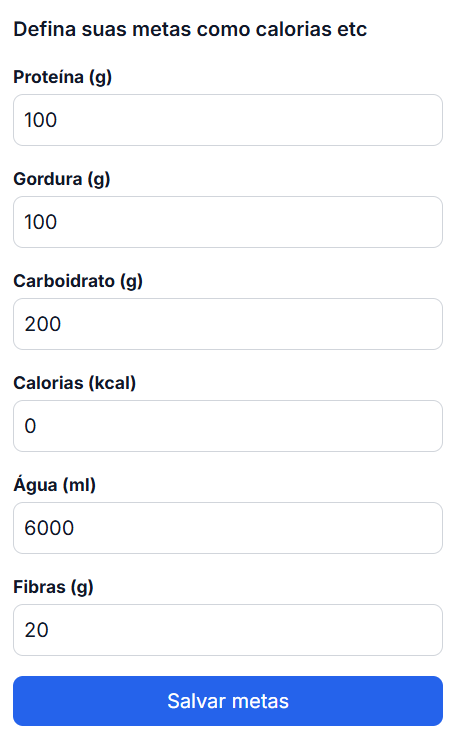
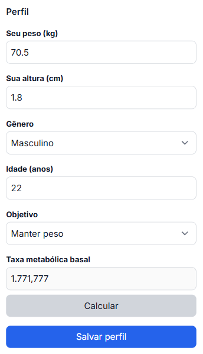

## Perfil do Usuário

<CardGroup>
  <Card title="Dados Pessoais" icon="user">
    Informações básicas e biométricas
  </Card>
  <Card title="Metas" icon="bullseye">
    Objetivos nutricionais e físicos
  </Card>
  <Card title="Preferências" icon="sliders">
    Configurações personalizadas
  </Card>
</CardGroup>

## Definição de Metas

<Steps>
  <Step title="Metas Específicas">
    - Meta de consumo de proteínas
    - Meta de consumo de gorduras
    - Meta de consumo de carboidratos
    - Meta de consumo de calorias
    - Meta de consumo de água
    - Meta de consumo de fibras
    
  </Step>
</Steps>

## Configuração do Perfil

<Steps>
  <Step title="Dados">
    - Peso atual
    - Altura
    - Gênero
    - Idade
    - Objetivo
    - Taxa metabólica basal
    
  </Step>
</Steps>

## Dicas de Configuração

<Steps>
  <Step title="Precisão">
    Mantenha seus dados sempre atualizados para cálculos precisos
  </Step>

  <Step title="Metas Realistas">
    Estabeleça objetivos alcançáveis e progressivos
  </Step>

  <Step title="Revisão Regular">
    Avalie e ajuste suas metas periodicamente
  </Step>
</Steps>
