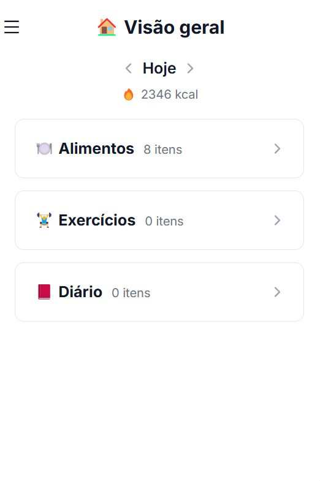
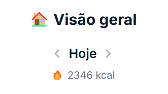
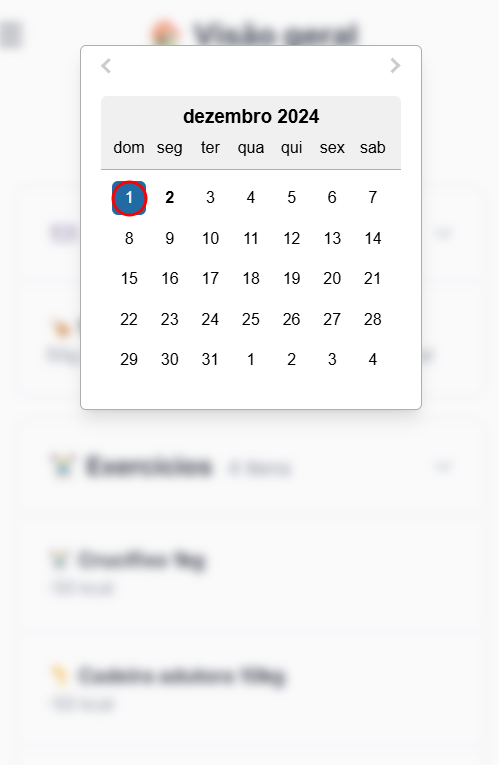
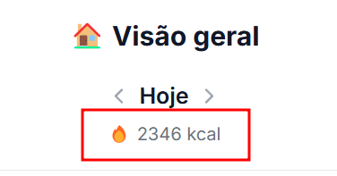
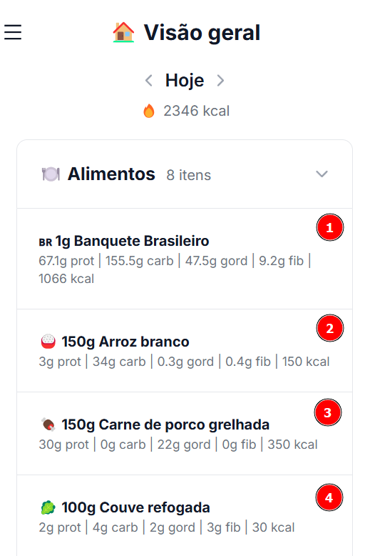
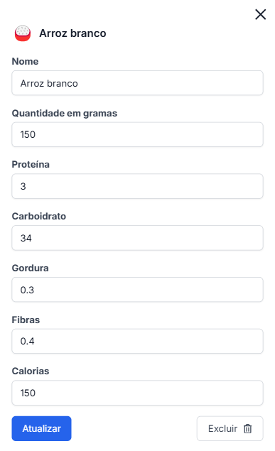

## Dashboard Principal

O painel de visão geral oferece um resumo completo das suas atividades diárias, organizadas em três categorias principais:

<CardGroup>
  <Card title="Alimentos" icon="utensils">
    Registros de refeições e alimentos consumidos no dia
  </Card>
  <Card title="Exercícios" icon="dumbbell">
    Atividades físicas e exercícios realizados
  </Card>
  <Card title="Diário" icon="book">
    Anotações e observações pessoais
  </Card>
</CardGroup>

## Navegação por Data

<Steps>
  <Step title="Navegue pelos dias">
    Use as setas para navegar entre os dias.
    
  </Step>
  <Step title="Abra o calendário">
    Clique na data atual ou no "Hoje" para abrir o calendário.
  </Step>
  <Step title="Selecione uma data">
    Escolha uma data específica no calendário.
    
  </Step>
</Steps>

## Balanço Calórico

O sistema calcula automaticamente o balanço calórico do dia:

## Gerenciando Registros

### Visualização de Itens
Clique no item que deseja visualizar.

<AccordionGroup>
  <Accordion title="Alimentos">
    Exibe para cada item:
    - Nome e emoji
    - Quantidade em gramas
    - Proteínas, carboidratos, gorduras e fibras
    - Calorias totais
  </Accordion>

  <Accordion title="Exercícios">
    Mostra para cada atividade:
    - Nome e emoji
    - Carga utilizada em kg
    - Calorias queimadas
  </Accordion>

  <Accordion title="Diário">
    Apresenta:
    - Título da anotação
    - Descrição detalhada
    - Emoji associado
  </Accordion>
</AccordionGroup>

### Edição de Registros

<Steps>
  <Step title="Selecione o item">
    Clique no item que deseja modificar.
    
  </Step>
  <Step title="Atualize as informações">
    Ajuste os dados necessários:
    - Nome/Título
    - Quantidades
    - Outros campos

    
  </Step>
  <Step title="Salve as alterações">
    Clique em "Atualizar" para salvar as alterações.
  </Step>
</Steps>

### Exclusão de Registros

<Steps>
  <Step title="Selecione o item">
    Escolha o item que deseja excluir.
  </Step>
  <Step title="Clique em Excluir">
    Pressione o botão "Excluir".
  </Step>
</Steps>

## Organização Visual

<Steps>
  <Step title="Seções Expansíveis">
    Cada categoria pode ser expandida ou recolhida para melhor visualização.
  </Step>
  <Step title="Contadores">
    Exibe o número total de itens em cada categoria.
  </Step>
  <Step title="Detalhamento">
    Permite acesso rápido aos detalhes de cada registro.
  </Step>
</Steps>

## Recursos Adicionais

<CardGroup>
  <Card title="Filtro por Data" icon="calendar">
    Visualize registros de qualquer dia específico.
  </Card>
  <Card title="Cálculos Automáticos" icon="calculator">
    Totalizações e balanços calculados em tempo real.
  </Card>
</CardGroup>
