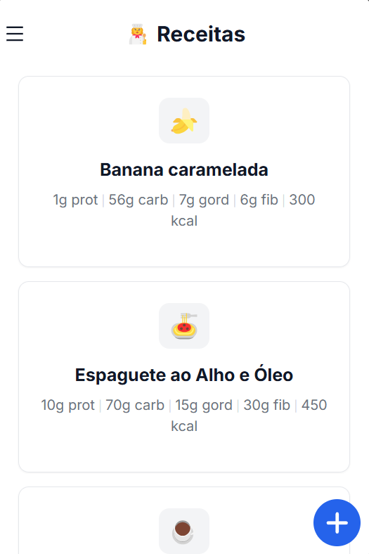
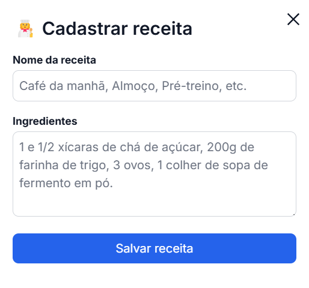

## Visão Geral das Receitas

<CardGroup>
  <Card title="Cadastro" icon="plus">
    Adicione novas receitas e alimentos
  </Card>
  <Card title="Gerenciamento" icon="list">
    Visualize e edite suas receitas
  </Card>
  <Card title="Macronutrientes" icon="chart-pie">
    Acompanhe valores nutricionais
  </Card>
</CardGroup>

## Criando uma Nova Receita

<Steps>
  <Step title="Informações Básicas">
    - Digite o nome da receita
    - Liste todos os ingredientes necessários
    - Especifique as quantidades de cada item
    - Adicione observações importantes
    
  </Step>
</Steps>

## Gerenciando Receitas

<Steps>
  <Step title="Visualização">
    - Nome e emoji da receita
    - Resumo dos macronutrientes
  </Step>
  
  <Step title="Edição">
    - Atualize nome e quantidade
    - Modifique ingredientes
    - Ajuste valores nutricionais
  </Step>
  
  <Step title="Exclusão">
    - Selecione a receita
    - Confirme a exclusão
    - Atualize sua lista
  </Step>
</Steps>

## Dicas de Uso

<Steps>
  <Step title="Organização">
    Mantenha suas receitas bem categorizadas com nomes claros
  </Step>
  
  <Step title="Atualização">
    Revise periodicamente os valores nutricionais para maior precisão
  </Step>
  
  <Step title="Planejamento">
    Use as receitas para planejar suas refeições semanais
  </Step>
</Steps>
