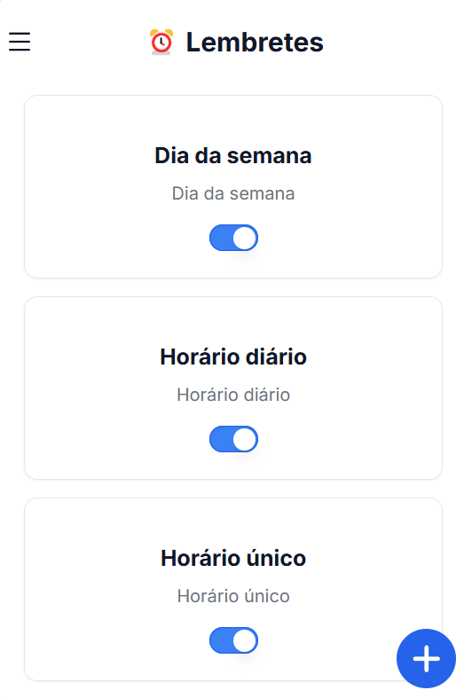
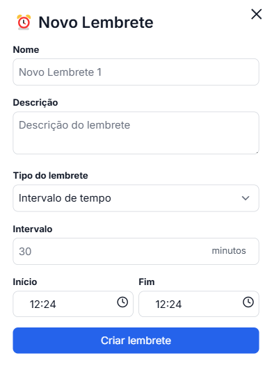
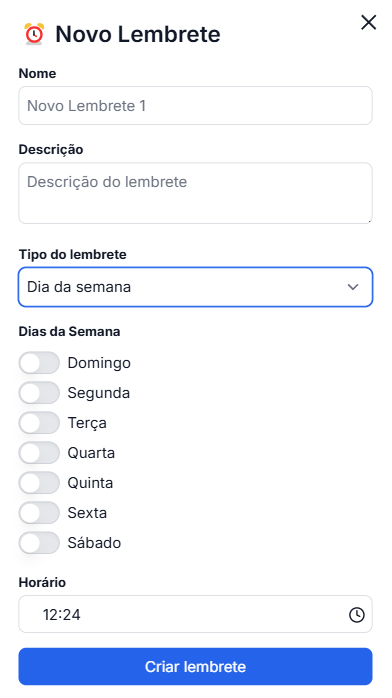
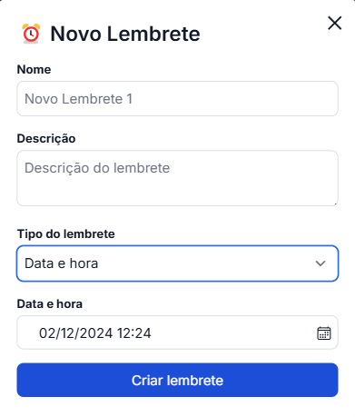
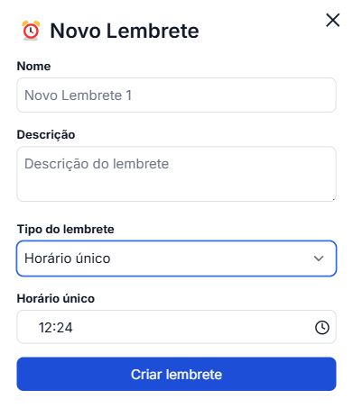
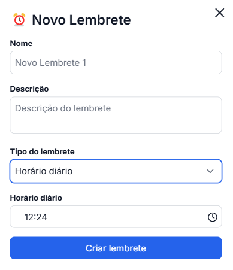

## Visão Geral

O sistema de lembretes do ZapNutri permite configurar notificações personalizadas para diferentes momentos do dia. Você pode criar lembretes para refeições, exercícios ou qualquer outra atividade relacionada à sua rotina de saúde.

## Tipos de Lembretes

<CardGroup>
  <Card title="Intervalo de Tempo" icon="clock">
    Configure lembretes que se repetem em intervalos específicos entre um horário inicial e final
  </Card>
  <Card title="Dia da Semana" icon="calendar-days">
    Defina lembretes para dias específicos da semana em um horário determinado
  </Card>
  <Card title="Data e Hora" icon="calendar-check">
    Agende um lembrete único para uma data e horário específico
  </Card>
  <Card title="Horário Único" icon="bell">
    Configure um lembrete que acontecerá apenas uma vez em um horário específico
  </Card>
  <Card title="Horário Diário" icon="rotate">
    Defina um lembrete que se repete todos os dias no mesmo horário
  </Card>
</CardGroup>

## Criando um Lembrete

<Steps>
  <Step title="Acesse a página de lembretes">
    Vá até a seção de lembretes no aplicativo.
  </Step>
  <Step title="Clique no botão de adicionar">
    Pressione o botão "+" para criar um novo lembrete.
  </Step>
  <Step title="Preencha os campos necessários">
    Complete os campos com as informações exigidas. Os campos variam dependendo do tipo de lembrete.
  </Step>
</Steps>

<Note>
  Cada tipo de lembrete possui campos específicos que devem ser preenchidos:
</Note>

### Intervalo de Tempo
- Defina o intervalo em minutos (1-59)
- Configure horário de início
- Configure horário de 

### Dia da Semana
- Selecione os dias da semana desejados
- Configure o horário para o lembrete

### Data e Hora
- Selecione a data específica
- Configure o horário desejado

### Horário Único
- Configure o horário para o lembrete único

### Horário Diário
- Configure o horário que se repetirá diariamente

## Gerenciando Lembretes

### Editar Lembrete

<Steps>
  <Step title="Selecione o lembrete">
    Clique no lembrete que deseja modificar.
  </Step>
  <Step title="Altere os campos">
    Faça as mudanças necessárias nos campos.
  </Step>
  <Step title="Salve as alterações">
    Clique em "Editar lembrete" para salvar.
  </Step>
</Steps>

### Excluir Lembrete

<Steps>
  <Step title="Selecione o lembrete">
    Clique no lembrete que deseja remover.
  </Step>
  <Step title="Role até o final">
    Desça até o final do formulário do lembrete.
  </Step>
  <Step title="Exclua o lembrete">
    Clique no botão "Excluir lembrete".
  </Step>
</Steps>

## Status dos Lembretes

<CardGroup>
  <Card title="Ativo" img="/images/lembretes-ativo.jpg"/>

  <Card title="Desativado" img="/images/lembretes-desativado.jpg"/>
</CardGroup>
