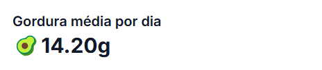

## Períodos de Análise

<CardGroup>
  <Card title="24 Horas" icon="clock">
    Análise das últimas 24 horas
  </Card>
  <Card title="3 Dias" icon="calendar-days">
    Visão dos últimos 3 dias
  </Card>
  <Card title="7 Dias" icon="calendar-week">
    Análise semanal
  </Card>
  <Card title="1 Mês" icon="calendar">
    Visão mensal completa
  </Card>
  <Card title="Total" icon="infinity">
    Histórico completo
  </Card>
</CardGroup>

## Métricas Principais

### Médias Nutricionais

<Steps>
  <Step title="Proteína">
    Média de consumo de proteínas no período selecionado
    
  </Step>
  <Step title="Carboidratos">
    Média de consumo de carboidratos no período selecionado
    
  </Step>
  <Step title="Gorduras">
    Média de consumo de gorduras no período selecionado
    
  </Step>
  <Step title="Déficit Calórico">
    Déficit calórico total no período selecionado
    
  </Step>
</Steps>

## Visualização Gráfica

<CardGroup>
  <Card title="Gráfico de Área" icon="chart-area">
    Visualização da evolução do consumo de macronutrientes
  </Card>
  <Card title="Tendências" icon="chart-line">
    Análise de padrões alimentares ao longo do tempo
  </Card>
</CardGroup>

## Recursos de Análise

### Filtros Temporais

Botões de acesso rápido para períodos predefinidos

### Indicadores de Performance

<CodeGroup>
  <Code title="Déficit Calórico">
    Diferença entre calorias consumidas e TMB
  </Code>
  <Code title="Médias Diárias">
    Consumo médio de macronutrientes por dia
  </Code>
</CodeGroup>

## Benefícios

<CardGroup>
  <Card title="Acompanhamento" icon="eye">
    Monitore seu progresso nutricional
  </Card>
  <Card title="Insights" icon="lightbulb">
    Identifique padrões e tendências
  </Card>
  <Card title="Ajustes" icon="sliders">
    Tome decisões baseadas em dados
  </Card>
</CardGroup>

## Dicas de Uso

<Steps>
  <Step title="Alterne entre diferentes períodos para análises comparativas"/>
  <Step title="Observe as médias de macronutrientes para ajustar sua dieta"/>
  <Step title="Acompanhe o déficit calórico para atingir seus objetivos"/>
  <Step title="Use o gráfico para visualizar tendências ao longo do tempo">
    
  </Step>
</Steps>
