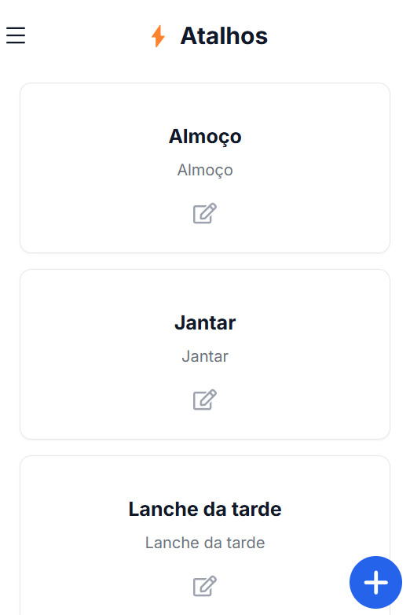

## Visão Geral dos Atalhos

<CardGroup>
  <Card title="Personalização" icon="wand-magic-sparkles">
    Crie comandos adaptados à sua rotina
  </Card>
</CardGroup>

## Criando Atalhos

<Steps>
  <Step title="Nome do Atalho">
    - Escolha um nome intuitivo
    - Fácil de lembrar
    - Relacionado à função
  </Step>

  <Step title="Definir Refeição">
    - Café da manhã
    - Almoço
    - Jantar
  </Step>

  <Step title="Comando">
    - Descreva a ação desejada
    - Seja específico nas quantidades
    - Inclua detalhes relevantes
  </Step>
</Steps>

## Exemplos de Uso

<Steps>
  <Step title="Refeições Padrão">
    "Adicionar café com leite e pão integral no café da manhã"
  </Step>

  <Step title="Relatórios">
    "Exibir relatório de proteínas da última semana"
  </Step>

  <Step title="Registros Rápidos">
    "Registrar treino de musculação com 40 minutos"
  </Step>
</Steps>

## Gerenciamento de Atalhos

<Steps>
  <Step title="Visualização">
    - Lista de atalhos ativos
    - Descrição dos comandos
    - Refeições associadas
  </Step>

  <Step title="Edição">
    - Modifique comandos existentes
    - Atualize refeições
    - Ajuste descrições
  </Step>

  <Step title="Exclusão">
    - Remova atalhos não utilizados
    - Confirme a exclusão
    - Mantenha sua lista organizada
  </Step>
</Steps>

## Dicas de Otimização

<Steps>
  <Step title="Nomenclatura Clara">
    Use nomes descritivos que facilitem a identificação
  </Step>

  <Step title="Comandos Precisos">
    Seja específico nas instruções para melhor execução
  </Step>

  <Step title="Organização">
    Mantenha seus atalhos mais usados facilmente acessíveis
  </Step>
</Steps>
